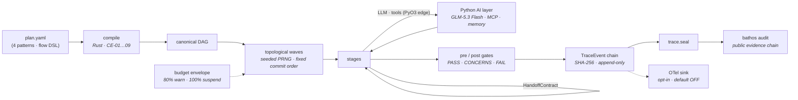
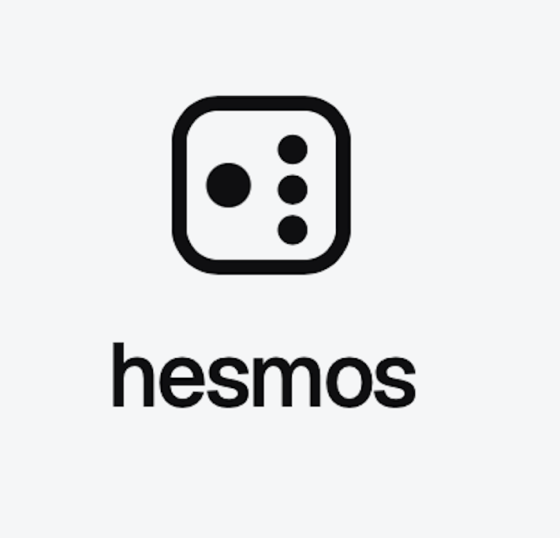
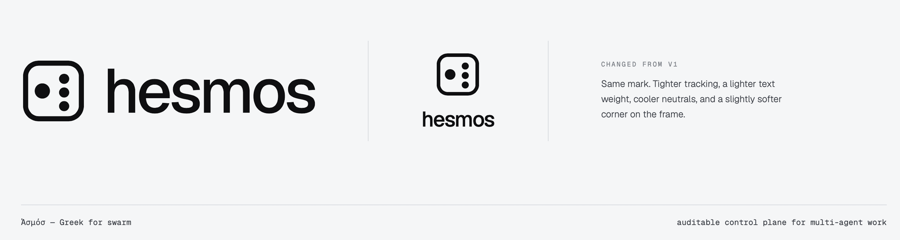

<div align="center">


### Ἀσμός — Greek for *the moment a hive takes flight*

**An auditable control plane for multi-agent work.**

*Flexibility at the edge, determinism in the waist.*

[](https://github.com/taxideftis/hesmos-pyren/actions/workflows/ci.yml)
[](LICENSE)


</div>

---

Most multi-agent frameworks sell you freedom and bill you in evidence: the same input takes a different path every run, context rots across handoffs, cost is unpredictable, and after 50 handoffs nobody can say which step caused the failure. Hesmos is the inversion.

**Everything that decides is deterministic. Everything that imagines stays at the edge.**

- A **Rust core** owns graph interpretation, scheduling, routing, and state transitions. Fix the seed, get the same run — byte for byte.
- A **Python layer** (via PyO3) stays where flexibility actually pays: LLM calls, tools, memory, judges.
- An **append-only event log** with a SHA-256 hash chain turns every session into tamper-evident evidence, replayable to any step.
- A **first-class CLI** and an optional **query-only gateway** expose the same vocabulary everywhere: `PASS / CONCERNS / FAIL`, `→ commit #N`, `‖ SUSPENDED — replay --at`.

> **Ἀσμός** is Greek for *the moment a hive takes flight*. The name is the promise: many agents, one audit trail.

---

## How it works



**One path through the system, five kinds of proof:** the seed reproduces the wave order, the chain reproduces the history, the contracts reproduce the handoffs, the exit code reproduces the verdict, and the seal hands the whole thing to a public audit chain.

## The deterministic waist

| Mechanism | Guarantee |
|---|---|
| Seeded PRNG + topological waves | Same plan + same seed ⇒ same node order, same commit sequence |
| Canonical serialization | `hash = sha256(prev_hash, seq, kind, node, attrs)` — wall-clock `ts` is stored but **excluded from the hash**, so replays match byte-for-byte |
| Cache invariants | System prompt and tool definitions are byte-stable for the session's lifetime; changes are **deferred by default** (`--now` is an explicit opt-in) |
| Handoff discipline | Schema-validated contracts only — max 20 handoffs, ping-pong window 8, bounded retry 2 with escalation |
| Cost envelope | 8K-token message cap; budget warns at 80%, suspends with a checkpoint at 100% |
| Failure semantics | `CANCELLED ≠ FAILED` — every termination carries one of 6 reason codes, and `hesmos trace replay --at` resumes from the last commit point |

## The flexible edge

Everything that needs to improvise lives behind the FFI boundary and never touches the waist:

- **GLM-5.3 Flash adapter** over an Anthropic-compatible endpoint — usage accounting on every call (`tokens_in` includes cache reads), key scrubbing on error paths, exactly one HTTP attempt per call (retries belong to the core)
- **MCP tool executor** with permission profiles and taint marking — tainted data is barred from memory persistence
- **Declarative memory & skills** — manifest-declared by default; arbitrary execution requires signed packages
- **Judge bridge** (opt-in) — judge prompt hash, temperature, and model version ride on gate events (`judge.*` attributes), so judge drift is traceable like everything else
- **OTel export** — an opt-in sink; default OFF, zero telemetry unless you ask

## Crates

| Crate | Role |
|---|---|
| `hesmos-core` | Task / Plan / Envelope / SessionHandle schemas — serde-validated at every boundary; exit-code map |
| `hesmos-trace` | Append-only `TraceEvent` log, SHA-256 hash chain, tamper detection |
| `hesmos-orchestrator` | GraphEngine: plan compile (CE-01…09), topological waves, seeded PRNG, gates & handoff enforcement |
| `hesmos-guard` | Contract verification, reason-code discipline, policy sets |
| `hesmos-budget` | Cost envelope, ledger, warn/suspend thresholds |
| `hesmos-ffi` | PyO3 boundary — the only Rust↔Python surface |
| `hesmos` | The CLI: `run`, `dry-run`, `trace show · replay`, `budget`, `eval`, `serve` |
| `gateway` | Optional HTTP/WS session API + query-only dashboard (the CLI owns all control) |

## Quick start

**Prerequisites:** Rust (channel pinned in [`rust-toolchain.toml`](rust-toolchain.toml)), Python 3.11+, and [maturin](https://www.maturin.rs/) for the Python layer.

```bash
# Rust workspace — build and test
cargo build --workspace
cargo test --workspace

# Python layer — build the extension and run the suite
pip install -e .
pytest

# Gateway end-to-end suite
cargo test -p gateway
```

### Plan → dry run → run

```console
$ hesmos run plan.hes --dry-run     # compile-check the DAG; no session created
$ hesmos run plan.hes --seed 42     # deterministic run; same seed, same trace hash
$ hesmos trace show <session_id>    # chain with per-node summaries and → commit #N markers
$ hesmos trace replay <session_id> --at step 37   # resume from commit #37
```

### Serve the gateway

```console
$ hesmos serve                      # HTTP/WS session API + read-only dashboard
$ cargo test -p gateway             # E2E suite (15 scenarios)
```

### Live model smoke (opt-in)

```console
$ HESMOS_GLM_LIVE=1 pytest tests/python/test_glm_adapter.py -k live   # key via env only
```

## Exit codes are the contract

| Exit | Meaning | CI branch |
|---:|---|---|
| `0` | Completed · verdict pass | pass |
| `2` | Usage / not-restorable point | fix invocation |
| `3` | Compile error (CE-01…09) · no session · serve startup failure | fix plan |
| `10` | `SUSPENDED` — budget exhausted · checkpoint kept (`replay --at`) | resume policy |
| `11` | `HALTED` — handoff / repetition guard | resume policy |
| `12` | `ABORTED` — external dependency exhausted | retry policy |
| `20` | `FAILED` — gate reject after retries, eval regression | investigate |
| `30` | Platform error (bathos `E-*` passthrough, evidence-invalid) | check platform |
| `130` | SIGINT — suspended at last commit point | resume policy |

Undefined states do not exist: if a run ends, one of these codes explains it.

## Design principles

Each principle is a review-rejection criterion, not a slogan.

| # | Principle | In one line |
|---|---|---|
| P1 | Deterministic waist | Graph interpretation, scheduling, routing, and state transitions live in Rust and reproduce under a fixed seed — LLM output never picks the next node |
| P2 | Type-safe boundaries | Every crate- and FFI-crossing datum passes serde/pydantic validation |
| P3 | Contract-first handoff | Agents cannot talk without a schema-validated `HandoffContract` |
| P4 | Cache is an invariant | System prompt & tool definitions are byte-stable per turn; changes default to deferred |
| P5 | Footprint ladder | New capability extends existing code first; core tools are the *last* resort |
| P6 | Event sourcing | All state changes are append-only events; every view is a replay |
| P7 | Least privilege, opt-in | Per-agent permission profiles; telemetry and external transmission default OFF |
| P8 | Inherit the engine | Gates, audit chains, state SSOT, and model plans are delegated to the [bathos](https://github.com/taxideftis/bathos) engine — never re-implemented here |

## Project status

🚧 **W5 implementation checkpoint** — the deterministic waist is standing, the AI layer and eval harness are landing.

| Wave | Scope | State |
|---|---|---|
| Foundation | Core schemas · trace hash chain · CLI surface · FFI skeleton | ✅ landed |
| Deterministic core | GraphEngine · gates · contracts · budget · replay + engine adapter | 🔄 in progress |
| AI layer | Prompt builder · GLM adapter · tools · memory | 🔄 in progress (builder & adapter landed) |
| Operations | Gateway + serve · eval harness · OTel sink | ✅ gateway / ⏳ eval |

Verified at checkpoint: workspace `cargo test`, `pytest` (53 passed + 1 gated live smoke), gateway E2E 15/15, `clippy -D warnings` clean. The [CI badge](https://github.com/taxideftis/hesmos-pyren/actions/workflows/ci.yml) is the live truth — it also enforces that the contract document's block count never drifts silently.

## Repository layout

```text
crates/
  hesmos-core/          # schemas, ids, plan, session, envelope, platform, policy
  hesmos-trace/         # append-only hash-chained event log
  hesmos-orchestrator/  # compile, engine, waves, prng (deterministic execution)
  hesmos-guard/         # contract verification, policy discipline
  hesmos-budget/        # envelope, ledger, thresholds
  hesmos-ffi/           # PyO3 boundary (the only Rust↔Python surface)
hesmos/                 # CLI binary: run, trace, budget, eval, serve
gateway/                # HTTP/WS API + query-only dashboard + E2E tests
bindings/python/        # pydantic mirrors, prompt builder, GLM adapter
tests/                  # integration (Rust) + unit (Python) suites
eval/                   # golden-trace suites
docs/
  pre/                  # design specification (HESMOS-DESIGN-001 REV A)
  trace-render-spec.md  # trace UI rendering contract
  img/                  # brand assets used by this README
```

## Branching model

```text
production (default)   ← release-ready; updated only by merging develop
develop                ← integration branch
feat/*                 ← all work happens here, branched from develop
```

## Documentation

- [Design specification](docs/pre/Agent_Hesmos_Spec_Arc.md) — the 25-page contract this implementation follows (Korean)
- [Trace rendering spec](docs/trace-render-spec.md) — how sessions render in CLI and dashboard

## Identity

<div align="center">
  
  <p><em>Ἀσμός — Greek for the moment a hive takes flight.</em></p>
</div>

<details>
<summary>Brand reference</summary>
<br>

</details>

## License

[MIT](LICENSE) © 2026 ταξιδευτής
